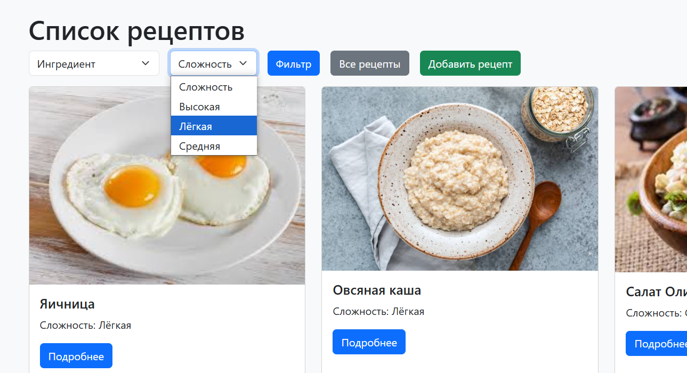
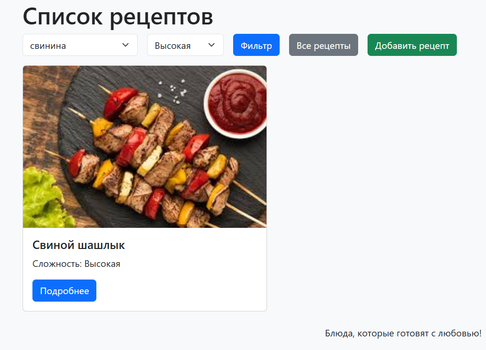
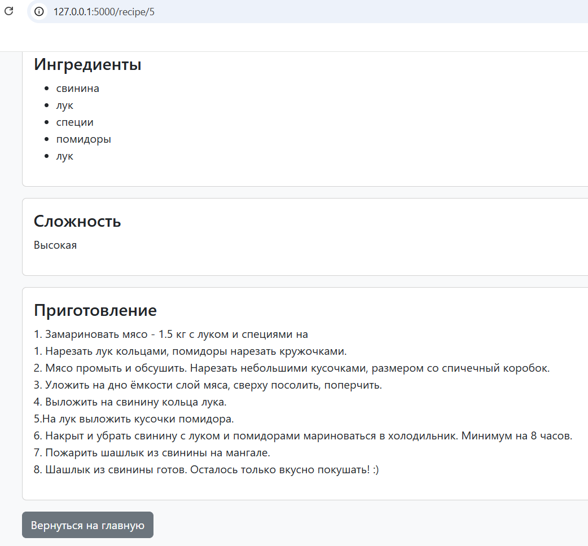
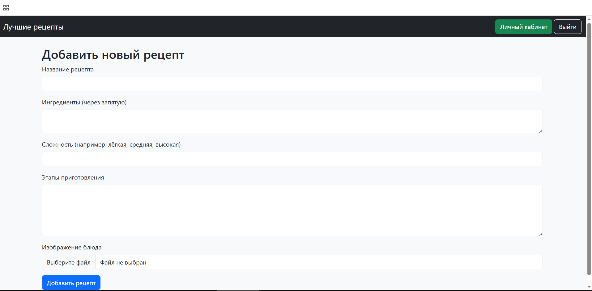
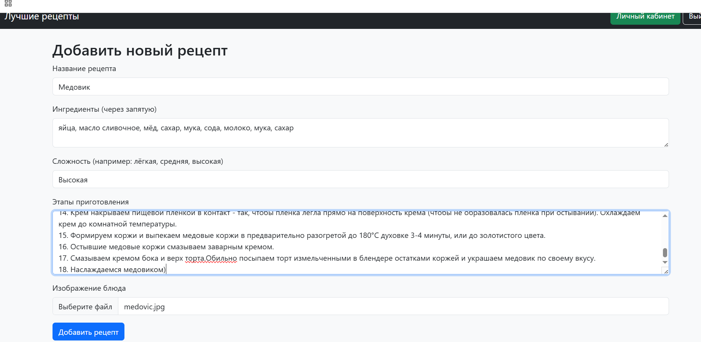
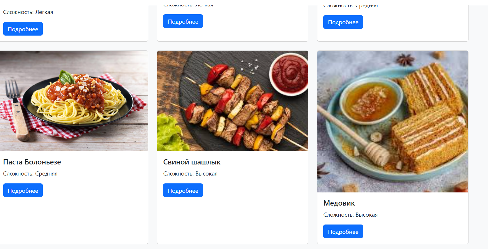

# Лабораторная работа 3

## Тема: "Создание высокоуровневого макета сайта"

## Цель работы

 Cайт представляет собой макет высокого уровня без функциональной части. Реализовать возможность демонстрации работы сайта, заполняя поля необходимой информацией и демонстрируя переходы между страницами сайта.

## Задача
Вариант 8

Сайт рецептов.


## Требования

Основные страницы:
1. Главная страница: Список рецептов с возможностью фильтрации по
ингредиентам, сложности приготовления.
2. Детальная страница рецепта: Полное описание приготовления, список
ингредиентов, фото готового блюда.
3. Добавление рецепта: Форма для ввода названия рецепта, ингредиентов,
этапов приготовления, загрузки изображения.
4. Личный кабинет: Список добавленных рецептов и редактирование
профиля. 

## Ход выполнения:
Проект имеет следующую структуру:

```
project
├── app.py
├── recipes.csv
├── static/
│   └── images/
├── templates/
│   ├── base.html
│   ├── index.html
│   ├── detail.html
│   ├── add_recipe.html
│   ├── profile.html
│   └── login.html
```

Где recipes.csv - БД, имеющая вид:

где,
```
id - номер рецепта;
title - название блюда; 
ingredients - ингридиенты, используемые для приготовления блюда;
complexity - сложность рецепта (Лёгкая, Средняя, Высокая);
steps - шаги приготовления блюда;
image_path - путь до изображения с готовым блюдом;
author - автор рецепт (рецепты, помеченные автором base - базовые и сразу есть в системе).
```
БД пополняется в ходе добавления рецептов.

## Код программы

```
import os
from flask import Flask, render_template, request, redirect, url_for
from sendgrid import SendGridAPIClient
from sendgrid.helpers.mail import Mail

app = Flask(__name__, template_folder=os.path.join(os.getcwd(), 'templates'))
SENDGRID_API_KEY = os.getenv("SENDGRID_API_KEY")


DOCTORS = [
    {"name": "Иванов И.И.", "specialty": "Терапевт"},
    {"name": "Петров П.П.", "specialty": "Хирург"},
    {"name": "Сидоров С.С.", "specialty": "Кардиолог"},
]

SCHEDULE = {
    "Иванов И.И.": ["10:00", "11:00", "15:00"],
    "Петров П.П.": ["09:00", "14:00", "16:00"],
    "Сидоров С.С.": ["08:00", "12:00", "17:00"],
}

appointments = []


@app.route('/')
def index():
    return render_template("index.html", doctors=DOCTORS, schedule=SCHEDULE)


@app.route('/schedule')
def schedule():
    return render_template("schedule.html", schedule=SCHEDULE)


@app.route('/appointment', methods=['GET', 'POST'])
def appointment():
    if request.method == 'POST':
        name = request.form['name']
        email = request.form['email']
        doctor = request.form['doctor']
        time = request.form['time']
        appointments.append({"name": name, "email": email, "doctor": doctor, "time": time})

        msg = Mail(
            from_email="arciomwyszynskitt@outlook.com",
            to_emails=email,
            subject="Подтверждение записи на прием",
            plain_text_content=f"Здравствуйте, {name}!\n\nВы записаны на прием к врачу {doctor} на {time}."
        )

        try:
            sg = SendGridAPIClient(SENDGRID_API_KEY)
            response = sg.send(msg)
            print(f"Email отправлен! Статус: {response.status_code}")
        except Exception as e:
            print(f"Ошибка при отправке письма: {e}")

        appointment_index = len(appointments) - 1
        return redirect(url_for('confirmation', name=name, doctor=doctor, time=time, appointment_index=appointment_index))

    return render_template("appointment.html", doctors=DOCTORS, schedule=SCHEDULE)


@app.route('/confirmation')
def confirmation():
    name = request.args.get('name')
    doctor = request.args.get('doctor')
    time = request.args.get('time')
    appointment_index = int(request.args.get('appointment_index'))
    return render_template("confirmation.html", name=name, doctor=doctor, time=time, appointment_index=appointment_index)


@app.route('/cancel_appointment/<int:index>', methods=['GET'])
def cancel_appointment(index):
    if 0 <= index < len(appointments):
        canceled_appointment = appointments.pop(index)
        msg = Mail(
            from_email="arciomwyszynskitt@outlook.com",
            to_emails=canceled_appointment['email'],
            subject="Отмена записи на прием",
            plain_text_content=f"Здравствуйте, {canceled_appointment['name']}!\n\nВаша запись на прием к врачу {canceled_appointment['doctor']} на {canceled_appointment['time']} была отменена."
        )
        try:
            sg = SendGridAPIClient(SENDGRID_API_KEY)
            response = sg.send(msg)
            print(f"Email об отмене отправлен! Статус: {response.status_code}")
        except Exception as e:
            print(f"Ошибка при отправке письма: {e}")

    return redirect(url_for('index'))


if __name__ == '__main__':
    app.run(debug=True)

```
 
## Результаты работы
1. Главная страница: Список рецептов с возможностью фильтрации по
ингредиентам, сложности приготовления.


 а) Возможность фильтрации по ингредиентам:

Список ингредиентов подтягивается из ingredients в recipes.csv и выводятся в алфавитном порядке.


В качестве примера работы выберем игредиент: яйца


 б) Возможность фильтрации по сложности приготовления:



 в) Применю оба фильтра: по сложности и по ингредиентам:


 г) Кнопка "Все рецепты" выводит все рецепты:


2. Детальная страница рецепта: Полное описание приготовления, список
ингредиентов, фото готового блюда.




3. Добавление рецепта: Форма для ввода названия рецепта, ингредиентов,
этапов приготовления, загрузки изображения.

Но перед тем как добавить рецепт необходимо авторизироваться:

Если мы не вошли в аккаунт, то после нажатия на кнопку "Добавить рецепт", мы перейдём на следующую страницу:


Нажмём на "Добавить рецепт":

Добавим рецепт медовика:

Теперь в БД есть наш медовик:

И на сайте появился новый рецкпт нашего Медовика:



4. Личный кабинет: Список добавленных рецептов и редактирование
профиля.
Добавленный рецепт отобразился в нашем профиле.


Редактирование профиля:

Обновление имени пользователя:
